# AIVentory - AI-Powered Inventory Management System


<div align="center">

 

  [](https://dotnet.microsoft.com/)
  [](https://reactjs.org/)
  [](https://vitejs.dev/)
  [](https://www.mysql.com/)
  [](LICENSE)
  
  **AI-powered inventory management system designed for small and medium-sized businesses**
  
  [Demo](http://localhost:5173) • [Documentation](#-documentation) • [Installation](#-installation) • [API Documentation](#-api-endpoints)
</div>

## 

<div align="center">
  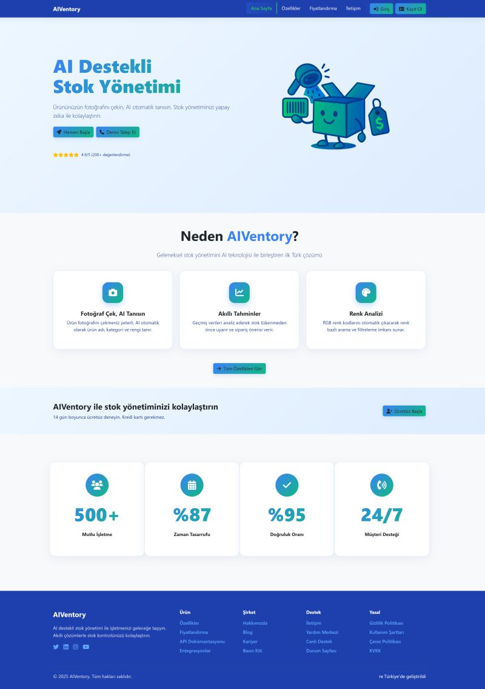
  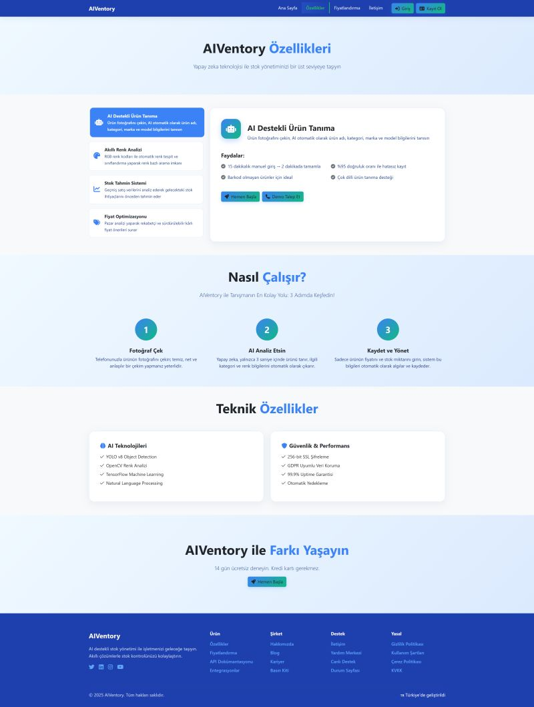
  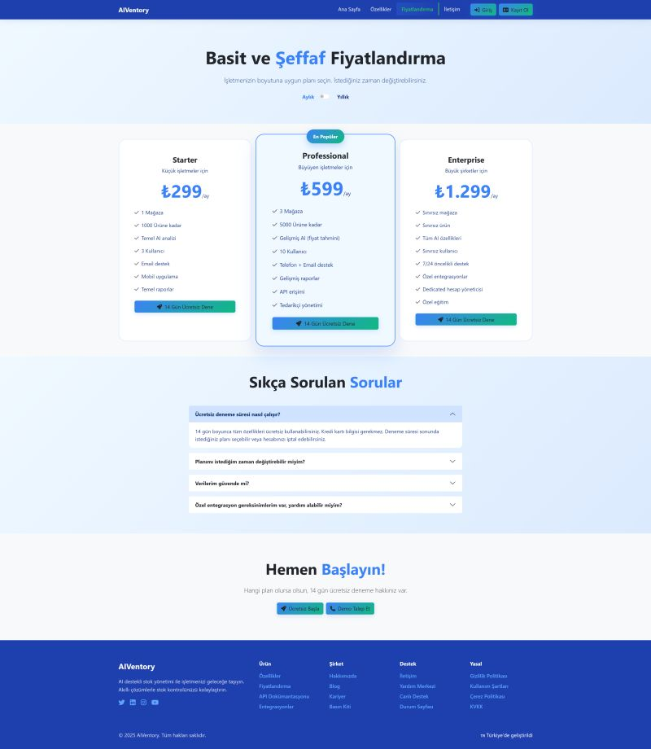
  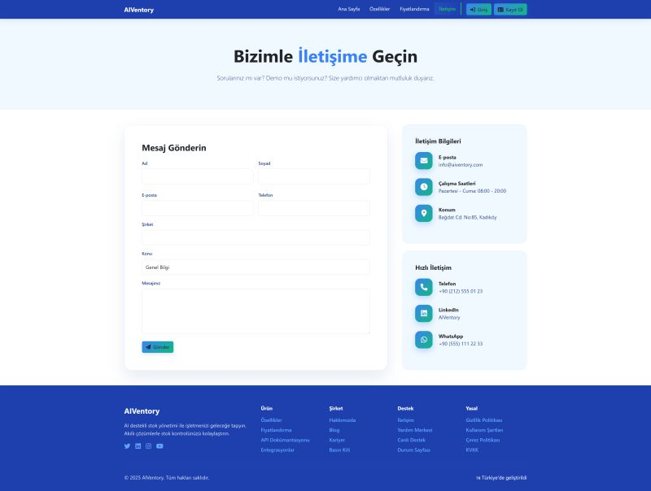
  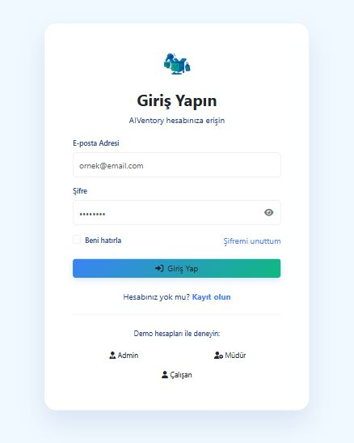
  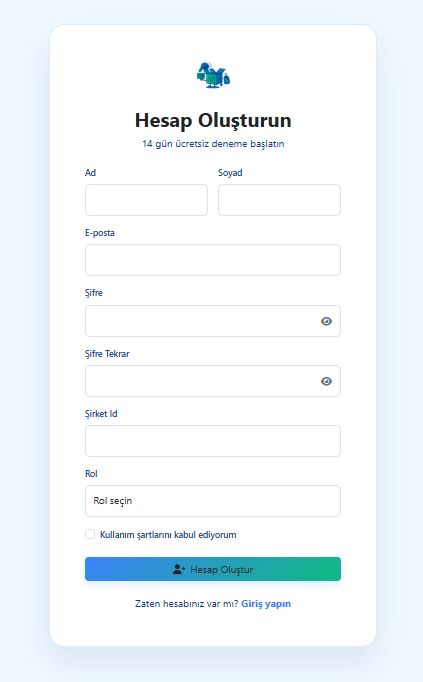
  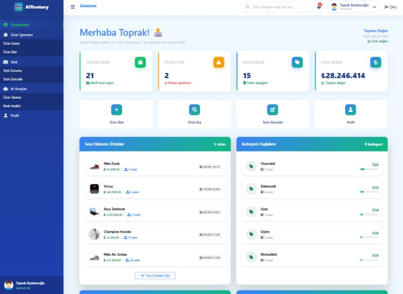
  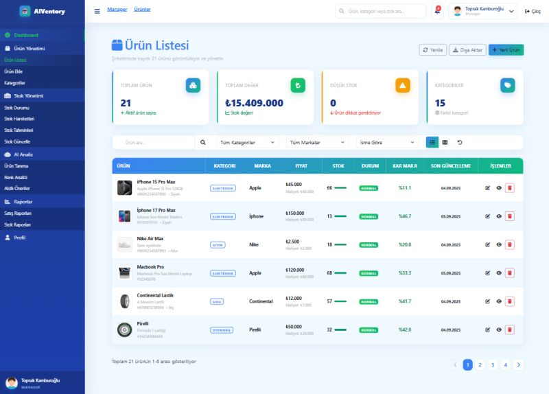
  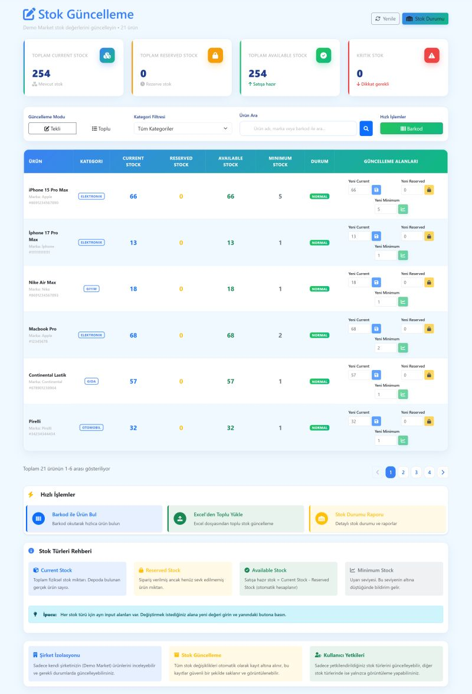
  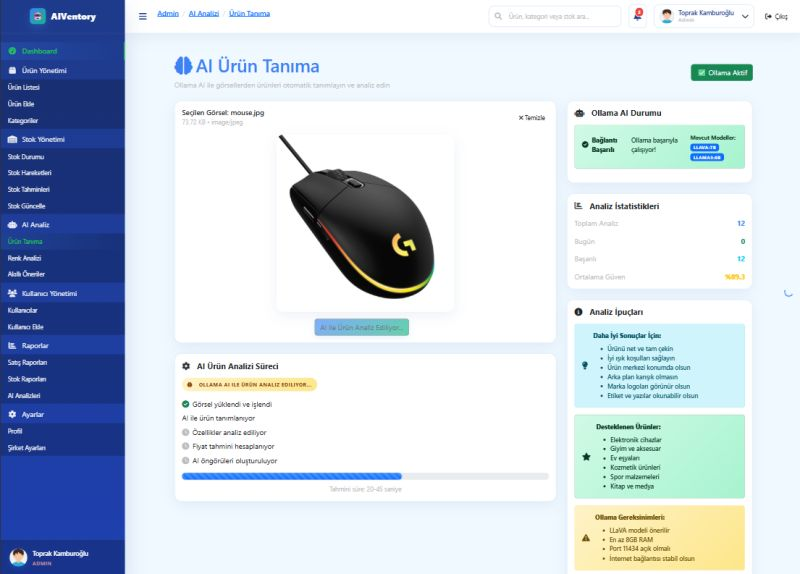
  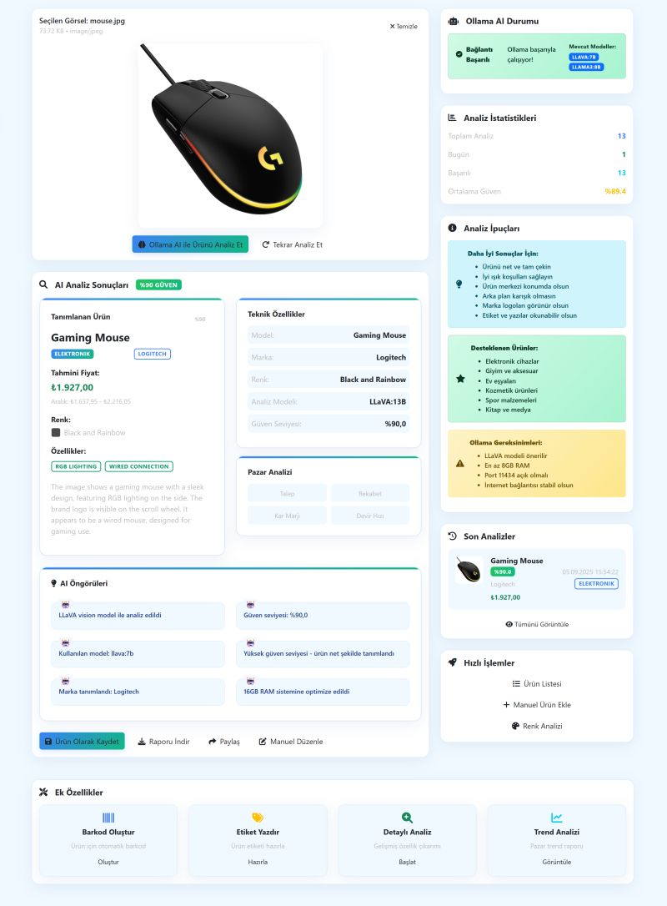
  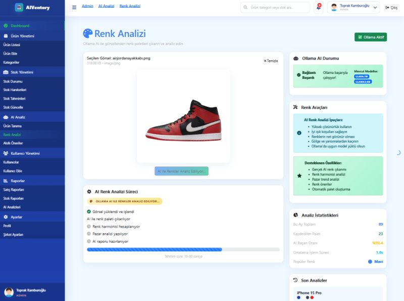
  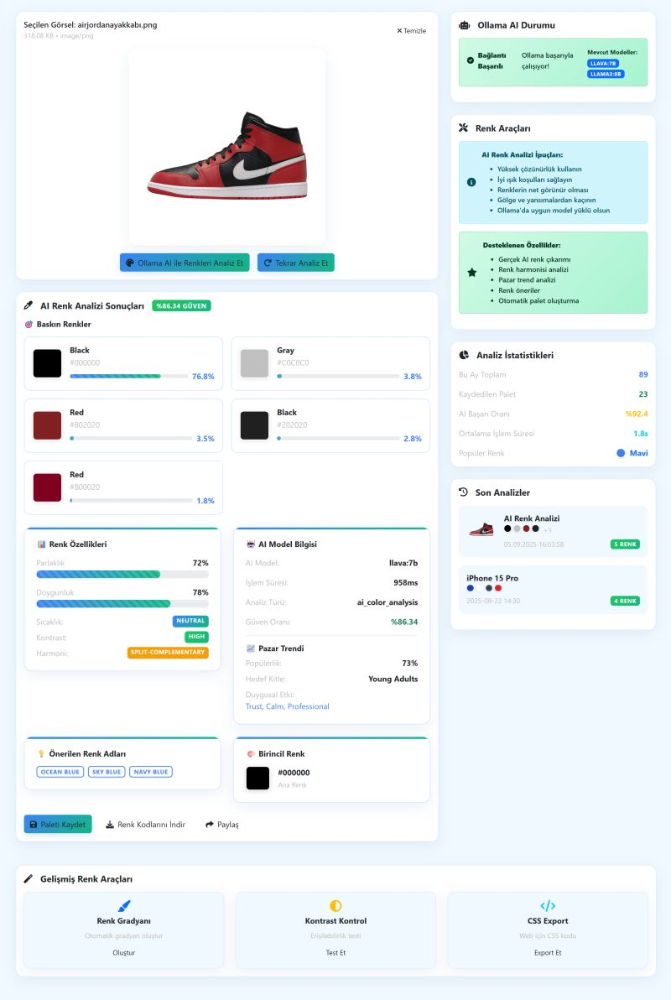

  <br/><br/>
  📽️ For detailed visualization visit my <a href="https://www.linkedin.com/feed/update/urn:li:activity:7369736709476954119/?originTrackingId=NG24IiHAky0HsfdHs5EIWg%3D%3D">LinkedIn post</a>
</div>

---

<div align="center">

| 📋 **Table of Contents** |   |
|--------------------------|---|
| [About the Project](#-about-the-project) | [About the Project |
| [Features](#-key-features) | Features |
| [Technology Stack](#-technology-stack) | Technology Stack |
| [Installation](#-installation) | Installation |
| [Usage](#-usage) | Usage |
| [API Endpoints](#-api-endpoints) | API Endpoints |
| [Database Schema](#-database-schema) | Database Schema |
| [Project Structure](#-project-structure) | Project Structure |
| [Role-Based Authorization](#-role-based-authorization) | Role-Based Authorization |
| [Contributing](#-contributing) | Contributing |
| [License](#-license) | License |

</div>


## 🎯 About the Project

**AIVentory** is an AI-powered inventory management system designed specifically for small and medium-sized businesses. The platform combines traditional inventory management with cutting-edge artificial intelligence technologies, offering smart solutions that transform how businesses handle their inventory operations.

### 🏢 Target Users

- **Small Markets & Grocery Stores** - Shops with manual inventory tracking
- **Pharmacies** - Products requiring expiration date tracking
- **Stationery & Gift Shops** - Stores with diverse product ranges
- **Small Restaurants & Cafes** - Ingredient inventory management

### 💡 Problems We Solve

- ⚡ **Product Entry**: AI-powered automatic product recognition via photos
- 🎨 **Color Management**: RGB analysis with automatic color categorization
- 📊 **Stock Prediction**: Intelligent stock recommendations based on historical data
- 💰 **Pricing**: AI-assisted competitive price recommendations
- 👥 **Multi-User**: Role-based authorization system

---

## ✨ Key Features

### 🤖 AI-Powered Features

- **Product Recognition**: Computer Vision for product, brand, and category detection from photos
- **Color Analysis**: OpenCV-based RGB color code extraction and automatic labeling
- **Stock Prediction**: Machine learning for future stock requirement forecasting
- **Price Recommendations**: AI-based competitive pricing analysis

### 📦 Inventory Management

- **Real-time Stock Tracking**: Live inventory status and movements
- **Critical Stock Alerts**: Automatic notifications below minimum levels
- **Stock Movements**: Entry, exit, transfer, and adjustment records
- **Barcode System**: Automatic barcode generation and scanning

### 👥 User Management

- **Role-Based Access**: Admin, Manager, Employee roles
- **Secure Authentication**: JWT token-based authentication
- **User Activity Logs**: Complete operation tracking
- **Company-Based Isolation**: Multi-tenant architecture

### 📊 Reporting & Analytics

- **Dashboard**: Real-time KPIs and charts
- **Sales Reports**: Daily, weekly, monthly sales analysis
- **Stock Reports**: Inventory status and trend analysis
- **AI Recommendations**: Smart business insights and suggestions

---

## 🛠 Technology Stack

### Backend
- **Framework**: ASP.NET Core 9.0
- **Authentication**: JWT Bearer Token
- **ORM**: Entity Framework Core
- **Database**: MySQL 8.0
- **Validation**: FluentValidation
- **Logging**: Serilog
- **Documentation**: Swagger/OpenAPI

### Frontend
- **Framework**: React 18.3.1
- **Build Tool**: Vite 5.4.10
- **Styling**: Bootstrap 5 + Custom CSS
- **State Management**: React Context API
- **HTTP Client**: Axios
- **Routing**: React Router v6

### AI & Computer Vision
- **Image Processing**: Ollama llava:13b
- **Object Detection**: Ollama llava:13b

### DevOps & Tools
- **Version Control**: Git
- **Package Manager**: npm (Frontend), NuGet (Backend)
- **IDE**: Visual Studio 2022, VS Code

---

## 🚀 Installation

### Prerequisites

- **Backend**: .NET 9.0 SDK
- **Frontend**: Node.js 18+, npm
- **Database**: MySQL 8.0+

### 1. Clone the Repository

```bash
git clone https://github.com/yourusername/aiventory.git
cd aiventory
```

### 2. Backend Setup

```bash
# Navigate to backend directory
cd AIVentory-backend

# Install NuGet packages
dotnet restore

# Configure database connection string
# Edit appsettings.json file

# Create and migrate database
dotnet ef database update

# Run the backend
dotnet run
```

### 3. Frontend Setup

```bash
# Navigate to frontend directory (new terminal)
cd aiventory-frontend

# Install dependencies
npm install

# Start development server
npm run dev
```

### 4. Database Setup

```sql
-- Create database in MySQL
CREATE DATABASE aiventory_db CHARACTER SET utf8mb4 COLLATE utf8mb4_unicode_ci;

-- Import backup file
mysql -u username -p aiventory_db < aiventory_db_backup.sql
```

### 5. Configuration

#### Backend (appsettings.json)
```json
{
  "ConnectionStrings": {
    "DefaultConnection": "Server=localhost;Database=aiventory_db;Uid=your_username;Pwd=your_password;"
  },
  "JwtSettings": {
    "SecretKey": "your-secret-key-here",
    "Issuer": "AIVentory",
    "Audience": "AIVentory-Users",
    "ExpiryDays": 7
  }
}
```

#### Frontend (.env)
```env
VITE_API_BASE_URL=https://localhost:7b
VITE_APP_NAME=AIVentory
```

---

## 🎮 Usage

### Demo Users

After system installation, you can test with the following demo users:

| Role | Email | Password | Permissions |
|------|-------|----------|-------------|
| Admin | admin@demo.com | admin123 | Full access |
| Manager | manager@demo.com | admin123 | Reporting, user management |
| Employee | employee@demo.com | admin123 | Product and stock operations |

### Basic Workflow

1. **System Login**
   ```
   http://localhost:5173/login
   ```

2. **Add New Product**
   - Dashboard → Products → New Product
   - Upload photo or take from camera
   - Review AI analysis results
   - Enter price and stock information

3. **Stock Tracking**
   - Dashboard → Stock Management
   - View current stocks
   - Check critical stock alerts
   - Record stock movements

4. **AI Analysis**
   - Dashboard → AI Reports
   - View stock predictions
   - Evaluate price recommendations
   - Review color analysis

---

## 🌐 API Endpoints

### Authentication
```http
POST /api/auth/login              # User login
POST /api/auth/register           # New user registration
POST /api/auth/forgot-password    # Password reset
POST /api/auth/reset-password     # Password change
```

### Products
```http
GET    /api/products              # Product list
GET    /api/products/{id}         # Single product details
POST   /api/products              # Create new product
PUT    /api/products/{id}         # Update product
DELETE /api/products/{id}         # Delete product
GET    /api/products/search       # Product search
```

### Stock
```http
GET    /api/stock                 # Stock status list
GET    /api/stock/{productId}     # Product stock details
POST   /api/stock/movement        # Add stock movement
GET    /api/stock/movements       # Stock movements list
GET    /api/stock/predictions     # Stock predictions
```

### AI Services
```http
POST   /api/ai/product-recognition  # Product recognition analysis
POST   /api/ai/color-analysis       # Color analysis
POST   /api/ai/price-prediction     # Price prediction
GET    /api/ai/recommendations      # AI recommendations
```

### Categories
```http
GET    /api/categories            # Category list
POST   /api/categories            # New category
PUT    /api/categories/{id}       # Update category
DELETE /api/categories/{id}       # Delete category
```

### Users (Admin Only)
```http
GET    /api/users                 # User list
POST   /api/users                 # New user
PUT    /api/users/{id}            # Update user
DELETE /api/users/{id}            # Delete user
```

### Reports
```http
GET    /api/reports/dashboard     # Dashboard data
GET    /api/reports/sales         # Sales reports
GET    /api/reports/stock         # Stock reports
GET    /api/reports/ai            # AI analysis reports
```

---

## 💾 Database Schema

### Main Tables

#### 🏢 Companies
```sql
- Id (PK)
- Name, Email, Phone
- SubscriptionPlan (Basic/Premium/Enterprise)
- MaxUsers, MaxProducts
- Created/UpdatedAt
```

#### 👤 Users
```sql
- Id (PK), CompanyId (FK)
- FirstName, LastName, Email
- PasswordHash, Role (admin/manager/employee)
- Avatar, LastLoginAt
- Created/UpdatedAt
```

#### 📦 Products
```sql
- Id (PK), CompanyId (FK), CategoryId (FK)
- Name, Description, Barcode, SKU
- Price, CostPrice, Brand, Model
- Color, ColorCode (RGB)
- Images (JSON), MinimumStock
- Created/UpdatedAt
```

#### 📊 Stock
```sql
- Id (PK), ProductId (FK)
- CurrentStock, ReservedStock
- AvailableStock (Computed)
- LastStockUpdate, LastCountDate
```

#### 📋 StockMovements
```sql
- Id (PK), ProductId (FK), UserId (FK)
- MovementType (in/out/adjustment)
- Quantity, PreviousStock, NewStock
- Reason, Notes, CreatedAt
```

#### 🤖 AIAnalysis
```sql
- Id (PK), ProductId (FK), CompanyId (FK)
- ImageUrl, AnalysisType, AnalysisResult (JSON)
- Confidence, DetectedName, DetectedCategory
- DetectedColor, SuggestedPrice
- CreatedAt
```

### Views

- **ProductStockView**: Combined product-stock view
- **DailyStockMovements**: Daily stock movement summary

### Triggers

- **after_product_insert**: Automatic stock record for new products
- **after_stock_movement_insert**: Stock status update after movements
- **check_low_stock**: Critical stock level notifications

---

## 📁 Project Structure

### Backend (.NET Core)
```
AIVentory-backend/
├── Controllers/          # API Controllers
│   ├── AuthController.cs
│   ├── ProductsController.cs
│   ├── StockController.cs
│   ├── AIController.cs
│   └── ...
├── Data/                 # Entity Framework
│   ├── ApplicationDbContext.cs
│   ├── Configurations/
│   └── Migrations/
├── Models/               # Data models
│   ├── Entities/
│   ├── DTOs/
│   ├── Common/
│   └── Enums/
├── Services/             # Business logic layer
│   ├── Interfaces/
│   └── Implementations/
├── Middleware/           # Custom middlewares
├── Helpers/              # Helper classes
└── Extensions/           # Extension methods
```

### Frontend (React + Vite)
```
aiventory-frontend/
├── public/               # Static files
│   ├── images/          # Logos and images
│   ├── css/             # Bootstrap CSS
│   └── js/              # External JS
├── src/
│   ├── components/      # Reusable components
│   ├── Pages/           # Page components
│   │   ├── Dashboard/   # Dashboard pages
│   │   │   ├── Admin/
│   │   │   ├── Manager/
│   │   │   └── Employee/
│   │   └── Promotion/   # Marketing pages
│   ├── Layouts/         # Layout components
│   ├── contexts/        # React Contexts
│   ├── hooks/           # Custom hooks
│   ├── services/        # API services
│   ├── utils/           # Helper functions
│   └── styles/          # CSS files
```

---

## 🎯 Role-Based Authorization

### 🔐 User Roles

| Role | Description | Color |
|------|-------------|-------|
| **Admin** | System administrator - Full access | 🔴 `#DC2626` |
| **Manager** | Business manager - Operational access | 🔵 `#2563EB` |
| **Employee** | Staff member - Limited operational access | 🟢 `#059669` |

### 🛡️ Detailed Permission Matrix

#### **👑 Admin Permissions**
```javascript
[
  'view_dashboard',         // Dashboard viewing
  'manage_products',        // Product management
  'add_product',           // Product adding
  'edit_product',          // Product editing
  'delete_product',        // Product deletion
  'manage_stock',          // Stock management
  'stock_adjustment',      // Stock adjustment
  'view_reports',          // Report viewing
  'export_reports',        // Report exporting
  'manage_users',          // User management
  'add_user',             // User adding
  'edit_user',            // User editing
  'delete_user',          // User deletion
  'ai_analysis',          // AI analysis
  'ai_recommendations',   // AI recommendations
  'change_password',      // Password changing
  'manage_settings',      // System settings
  'manage_categories',    // Category management
  'view_analytics'        // Analytics viewing
]
```

#### **👔 Manager Permissions**
```javascript
[
  'view_dashboard',         // Dashboard viewing
  'manage_products',        // Product management
  'add_product',           // Product adding
  'edit_product',          // Product editing
  'manage_stock',          // Stock management
  'stock_adjustment',      // Stock adjustment
  'view_reports',          // Report viewing
  'export_reports',        // Report exporting
  'ai_analysis',          // AI analysis
  'ai_recommendations',   // AI recommendations
  'change_password',      // Password changing
  'manage_categories',    // Category management
  'view_analytics'        // Analytics viewing
]
```

#### **👥 Employee Permissions**
```javascript
[
  'view_dashboard',         // Dashboard viewing
  'add_product',           // Product adding
  'view_products',         // Product viewing
  'view_stock',           // Stock viewing
  'update_stock',         // Stock updating
  'search_products',      // Product searching
  'ai_analysis',          // AI analysis
  'change_password'       // Password changing
]
```

### 📱 Role-Based Sidebar Menus

#### **👑 Admin Menu**
```
📊 Dashboard
📦 Product Management
   ├── Product List
   ├── Add Product
   └── Categories
🏭 Stock Management
   ├── Stock Status
   ├── Stock Movements
   ├── Stock Predictions
   └── Update Stock
🤖 AI Analysis
   ├── Product Recognition
   ├── Color Analysis
   └── Smart Recommendations
👥 User Management
   ├── Users
   └── Add User
📊 Reports
   ├── Sales Reports
   ├── Stock Reports
   └── AI Analysis
⚙️ Settings
   ├── Profile
   └── Company Settings
```

#### **👔 Manager Menu**
```
📊 Dashboard
📦 Product Management
   ├── Product List
   ├── Add Product
   └── Categories
🏭 Stock Management
   ├── Stock Status
   ├── Stock Movements
   ├── Stock Predictions
   └── Update Stock
🤖 AI Analysis
   ├── Product Recognition
   ├── Color Analysis
   └── Smart Recommendations
📊 Reports
   ├── Sales Reports
   └── Stock Reports
👤 Profile
```

#### **👥 Employee Menu**
```
📊 Dashboard
📦 Product Operations
   ├── Product List
   └── Add Product
🏭 Stock
   ├── Stock Status
   └── Update Stock
🤖 AI Tools
   ├── Product Recognition
   └── Color Analysis
👤 Profile
```

### 📊 Dashboard Cards - Role-Based

| Card | Admin | Manager | Employee |
|------|-------|---------|----------|
| Total Products | ✅ | ✅ | ✅ |
| Critical Stock | ✅ | ✅ | ✅ |
| Daily Sales | ✅ | ✅ | ❌ |
| Total Users | ✅ | ❌ | ❌ |
| AI Recommendations | ✅ | ✅ | ❌ |
| Sales Chart | ✅ | ✅ | ❌ |
| Stock Movements | ✅ | ✅ | ❌ |
| User Activities | ✅ | ❌ | ❌ |
| Recent Activities | ❌ | ❌ | ✅ |
| Quick Actions | ❌ | ❌ | ✅ |

---

## 🧪 Test Scenarios

### Product Management Test
```javascript
// Adding new product
1. Login (admin@demo.com)
2. Products → Add Product
3. Upload photo
4. Wait for AI analysis
5. Review and save information
```

### Stock Tracking Test
```javascript
// Recording stock movement
1. Stock Management → Update Stock
2. Select product
3. Choose movement type (In/Out)
4. Enter quantity
5. Save and check stock status
```

### AI Analysis Test
```javascript
// Color analysis
1. AI Analysis → Color Analysis
2. Upload product photo
3. Check RGB color codes
4. Review automatic tag suggestions
```

---

## 🔧 Development

### Local Development

```bash
# Backend development
cd AIVentory-backend
dotnet watch run

# Frontend development
cd aiventory-frontend
npm run dev

# Database migration
dotnet ef migrations add MigrationName
dotnet ef database update
```

### Code Standards

- **Backend**: C# Coding Conventions
- **Frontend**: ESLint + Prettier
- **Database**: Snake_case naming
- **API**: RESTful conventions

### Git Workflow

```bash
# Create feature branch
git checkout -b feature/new-feature

# Commit changes
git add .
git commit -m "feat: add new feature"

# Create pull request
git push origin feature/new-feature
```

---

## 📚 Documentation

### API Documentation
- **Swagger UI**: `https://localhost:7b/swagger`
- **OpenAPI Spec**: `/swagger/v1/swagger.json`

### Database Documentation
- **ERD**: Database schema diagrams
- **Backup**: `aiventory_db_backup.sql`

### User Guide
- **Admin Panel**: System management guide
- **AI Features**: Computer vision usage guide
- **Stock Management**: Business process documentation

---

## 🤝 Contributing

To contribute to the project:

1. **Fork** the repository
2. Create a **feature branch** (`git checkout -b feature/AmazingFeature`)
3. **Commit** your changes (`git commit -m 'Add some AmazingFeature'`)
4. **Push** to the branch (`git push origin feature/AmazingFeature`)
5. Open a **Pull Request**

### Contribution Guidelines
- Follow code standards
- Write unit tests
- Update documentation
- Discuss in issues

---

## 🐛 Known Issues

- AI analysis results may sometimes be delayed
- Large image file upload issues
- Mobile responsive improvements ongoing

## 🔮 Future Plans

- **Mobile App**: React Native mobile application
- **Advanced AI**: More sophisticated ML models
- **Multi-language**: Multi-language support
- **API Integration**: ERP systems integration
- **Barcode Scanner**: Mobile barcode reading
- **Voice Commands**: Voice command support

---

## 📄 License

This project is licensed under the [MIT License](LICENSE).

---

## 📞 Contact

**Project Owner**: Toprak Kamburoğlu
- **Email**: toprakkamburoglu@gmail.com
- **LinkedIn**: [linkedin.com/in/toprakkamburoglu](www.linkedin.com/in/toprak-kamburoğlu-627636293)
- **GitHub**: [github.com/toprakkamburoglu](https://github.com/ToprakKamburoglu)

---
